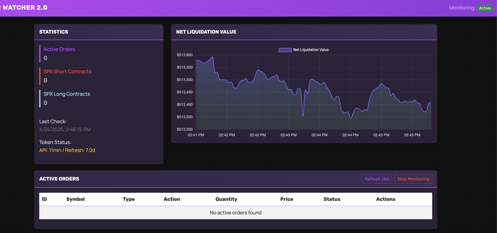

# TheWatcher

<!-- Including dashboard screenshot here for quick visual context; helps users understand the UI before reading features -->


## Features

- Monitors active Schwab orders and attempts to automatically recreate them if they are cancelled or rejected.
- Web dashboard with live statistics, order table, and net liquidation value chart.
- Secure (optional) HTTP Basic Auth for dashboard access.
- Token status monitoring and warning system.
- Ignore list for orders and symbols.

## Setup

1. **Clone the repository**  
   `git clone https://github.com/lolrip/TheWatcher.git`

2. **Install dependencies**  
   ```
   pip install -r requirements.txt
   ```

3. **Configure environment variables**  
   - Copy `env.example` to `.env` and fill in your Schwab API credentials and Flask credentials.

4. **Authenticate with Schwab**  
   - Run `python authenticate.py` and follow the instructions to generate your `token.json`.

5. **Run the application**  
   ```
   python app.py
   ```
   - The dashboard will be available at `http://localhost:5001` (or the port you set).

## Usage
- Enter a trade manually
- Set a stop order manually
- The Watcher will detect the resting stop order and begin to monitor it

## File Structure

- `app.py` - Main Flask app and background monitor thread.
- `monitor.py` - Order monitoring and recreation logic.
- `authenticate.py` - Schwab authentication utility.
- `templates/index.html` - Dashboard UI.
- `.env` - Environment variables (not committed).
- `token.json` - Schwab API token (not committed).
- `ignored_items.json` - Ignore list persistence (not committed).

## Security

- Never commit your `.env`, `token.json`, or any credential files.
- Use strong passwords for Flask authentication.
- Use at your **OWN RISK** and always monitor your accounts and positions.

## Credits

Created by the Research & Development Team at [Speaking Greeks](https://speakinggreeks.com).
